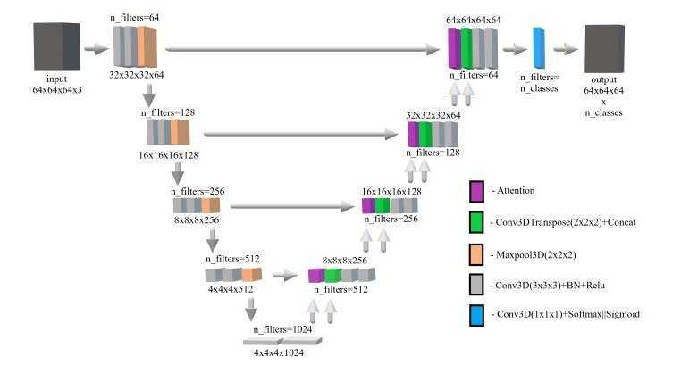
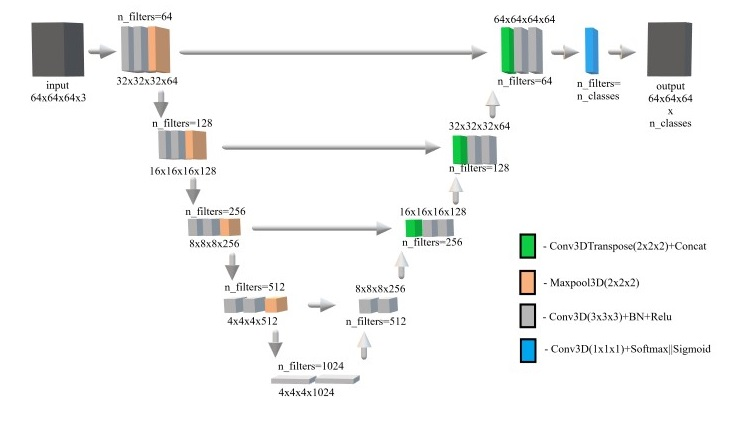

# 3D-Unet-Segmentation
Implementation of 3D-Unet on Keras for sandstone segmentation. 
 
The repository contains two experiments: 
 
1) [with](https://github.com/Gainward777/3D-Unet-Segmentation/blob/main/3D_Unet_Segmentation_with_Attention.ipynb) the attention mechanism: 

 

 
 

 

2) and [without](https://github.com/Gainward777/3D-Unet-Segmentation/blob/main/3D_Unet_Segmentation.ipynb) it: 

 

 

 
<a href="https://drive.google.com/drive/folders/1HbzT_tLKZdcxpj8erUF6LqKcnd9rVCRd?usp=sharing">Download data from gdrive</a>
 

